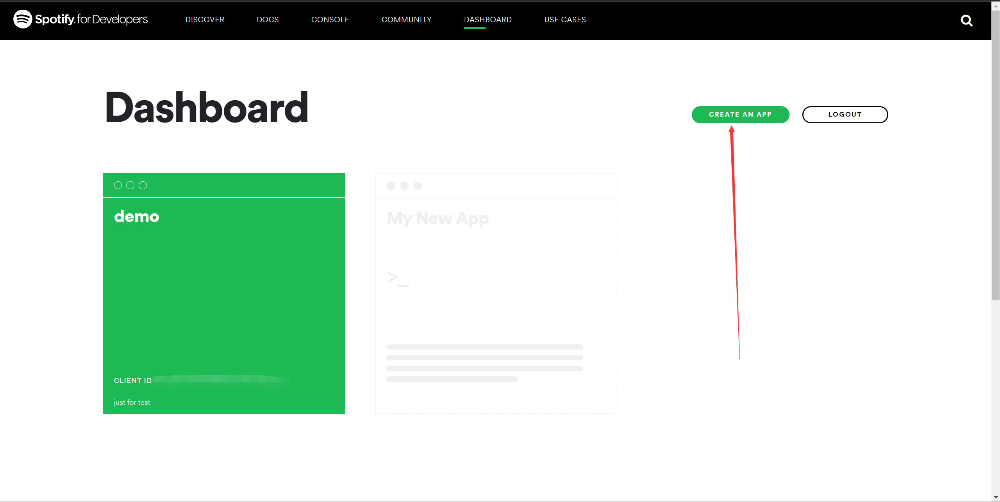
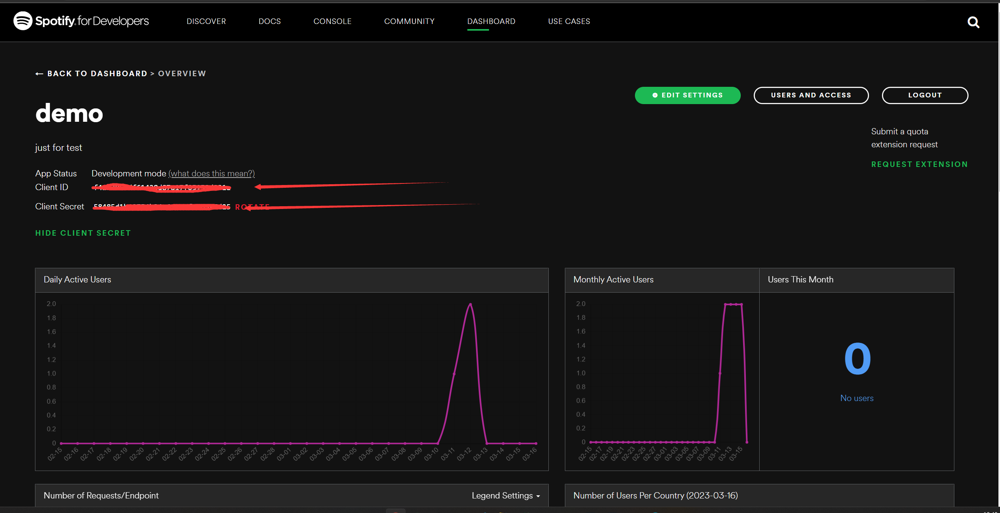
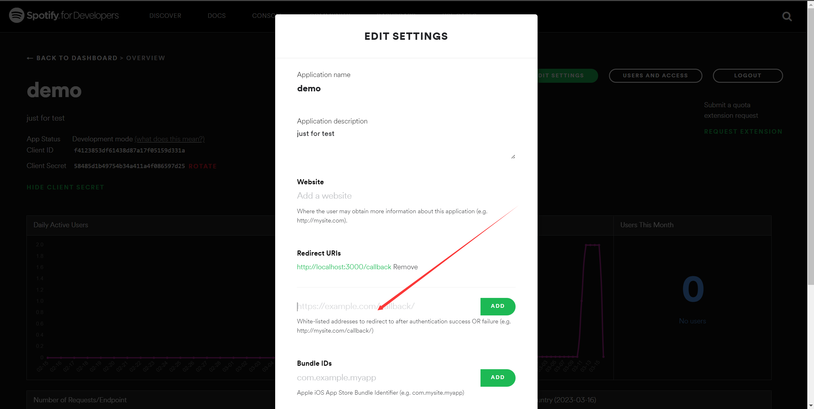
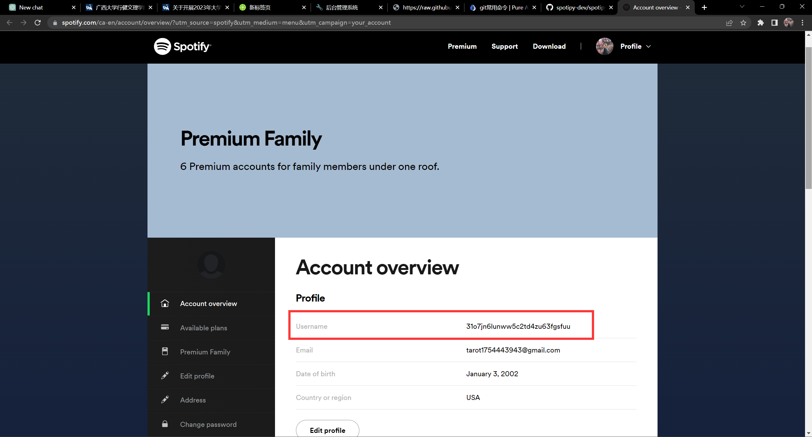
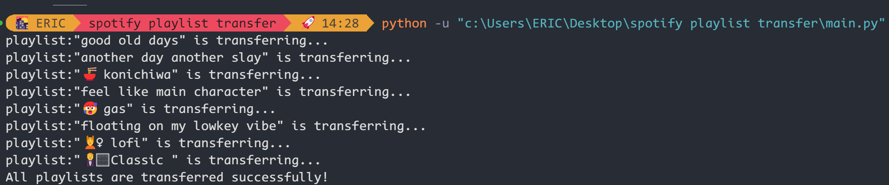
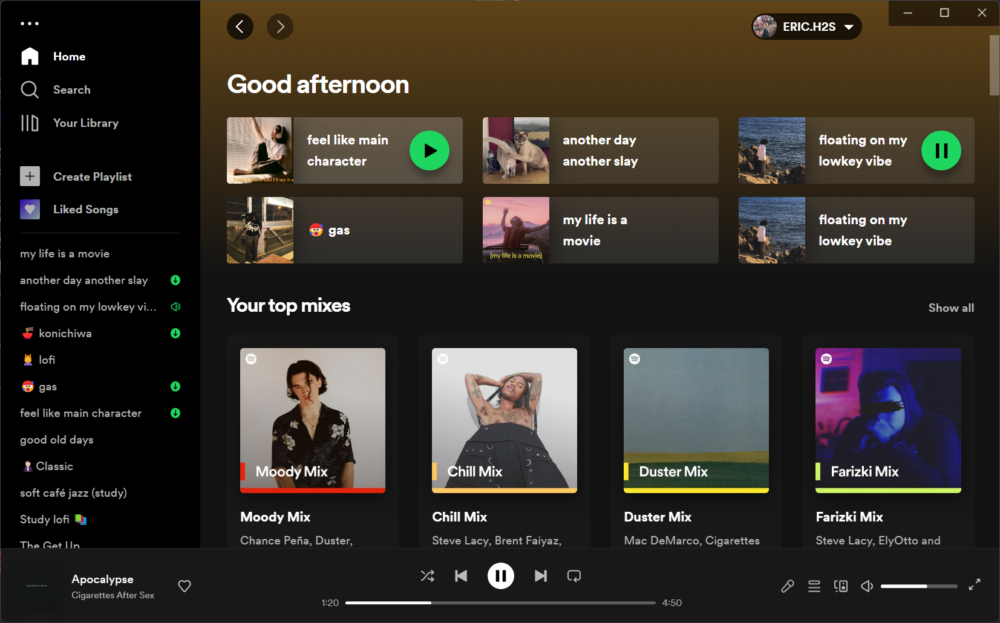

# 📦 Spotify Playlist Migrator (spotify歌单迁移)
A simple script using spotify api to migrate all Spotify playlists from one account to yours, and arranged in the order of their original added date.

一个简单的脚本，使用spotify api将所有Spotify播放列表从一个账户迁移到你的账户，并按其原始添加日期的顺序排列。

## Usage
1. Create a new app in [Spotify Developer Dashboard](https://developer.spotify.com/dashboard/applications) and get the `client id` and `client secret`. 

2. Set the redirect uri to `http://localhost:3000/callback` and save the app.

3. Clone this repo and install dependency packages.
4. Set your `client id` and `client secret` in `main.py`.
5. Set `old_usename`(The account you want to migrate from) and `new_username`(Your account) in `main.py`.

(this is your username, not your display name)
6. Run `main.py`.

## 使用方法
1. 在[Spotify Developer Dashboard](https://developer.spotify.com/dashboard/applications)中创建一个新的应用程序，并获取`client id`和`client secret`。

2. 将重定向uri设置为`http://localhost:3000/callback`并保存应用程序。

3. 克隆此存储库并安装依赖包。
4. 在`main.py`中设置您的`client id`和`client secret`。

5. 在`main.py`中设置`old_usename`(您要从中迁移的帐户)和`new_username`(您的帐户)。

(这是您的用户名，而不是您的显示名称)
6. 运行`main.py`。

🚀🎉Transfer susccessfully!

